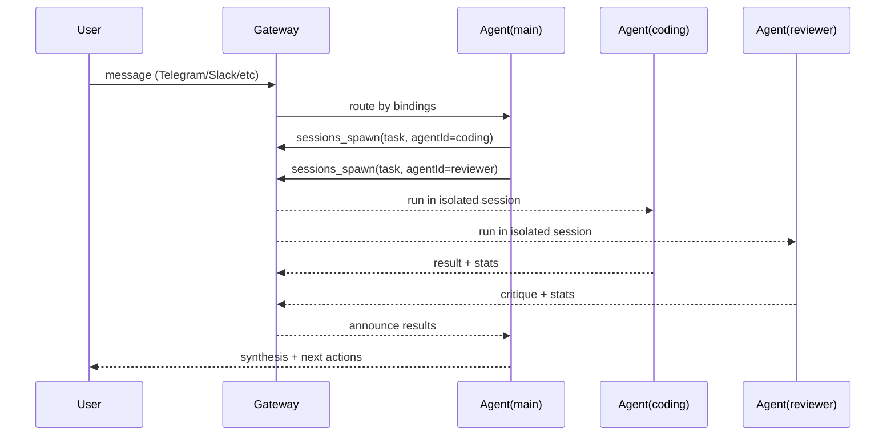

# OpenClawが画期的な5つの理由

OpenClawが従来のAIエージェントに比べて画期的であるのは以下の5つの理由によるものである。

1. 常時稼働
ユーザーから指示された時だけでなく365日24時間常に稼働している。自律性を与えることで自発的に行動を行っていく。

2. メモリの永続化
稼働中に得た経験や知識をファイルに記録するため、過去のことを覚えている。記憶が一つのセッションに限定される他のAIエージェントとの大きな違い。

3. スキルの拡張
標準的なエージェントスキルを拡張したスキル機能を持つ。様々なスキルが流通し、それを与えるだけで複雑な作業を行うことができる。

4. マルチチャンネル対話機能
Telegram, Discord, LINE, Teams, Slackなどに対応しており、その部屋PCから手軽に指示を行うことができる。エージェントからのフィードバックを得ることもできる。

5. マルチエージェント機能
一つのOpenClawで異なる役割を持つ複数のエージェントを同時に稼働させることができる。

# OpenClawの5つの主張の検証レポート

## エグゼクティブサマリー

本調査は、OpenClawが掲げる「常時自律運転・永続メモリ・拡張スキル・マルチチャネル・マルチエージェント」の5点を、一次情報（公式ドキュメント／GitHub／リリース）中心に検証した。結論として、**5項目はいずれも“仕組みとして存在”し、公式ドキュメントと実装（ファイル配置・CLI・プラグイン）で裏づけ可能**。ただし「できる＝安全・低コスト・運用容易」ではなく、常時稼働／スキル配布／外部チャネル接続は攻撃面と運用負荷を同時に増やす。citeturn2view3turn4search4turn3search0turn3search3turn6view0

確認できた最新系統（JST 2026-02-26時点の公開情報）として、コアは `https://github.com/openclaw/openclaw`、最新リリースは **v2026.2.24（commit 51d76eb）**。このリリースは常時運用に直結する“Heartbeat配信のDM宛ブロック”など安全側の破壊的変更を含む。citeturn7view0turn2view3

**リスク／対策（要点のみ）**
- スキル配布（ClawHub）と常時稼働は、供給網・プロンプト注入・資格情報窃取のリスクを増幅するため、**ClawHub自動導入の無効化、スキルのソースレビュー、サンドボックス化、Gateway公開面の最小化**が実務上の必須条件になる。citeturn11view3turn3search1turn22search10turn2view3

## 調査方法と検証方針

一次情報として、OpenClaw公式ドキュメント（docs.openclaw.ai）、公式サイト（openclaw.ai）、GitHubリポジトリとリリースノートを参照し、各主張が「設定項目・保存先・API/CLI・プラグイン・リリースで言及されるか」を確認した。citeturn2view3turn3search11turn7view0turn9search5  
日本語一次情報は限られるため、国内の公的DB（JVN iPediaの検索情報）や日本語解説（Zenn/Qiita/note）を補助証拠として扱い、未記載の点は「未記載」と明示する。citeturn20search1turn20search2turn4search9turn5search23

## 全体アーキテクチャ概観

OpenClawは「**Gateway（制御プレーン）＋エージェント実行系（PiをRPCで呼ぶ）＋ローカル状態（~/.openclaw）＋ワークスペース（Markdown中心）＋チャネル/プラグイン**」の構造で、チャットアプリ群を“統一インボックス”として扱う。GatewayはWebSocket制御面（例：`ws://127.0.0.1:18789`）を持ち、セッション、ルーティング、cron/heartbeat、Web UI、ツール呼び出しを集約する。citeturn2view3turn6view3turn22search10

```mermaid
flowchart LR
  U[User] -->|Telegram/Discord/Slack/LINE/Teams| CH[Channel adapters<br/>core + plugins]
  CH --> GW[Gateway<br/>sessions / routing / cron+heartbeat / tools / Web UI]
  GW --> PI[Pi agent runtime (RPC)<br/>tool streaming + compaction]
  PI --> TL[Tools<br/>exec / browser / files / sessions_* / cron / nodes]
  GW --> FS[(~/.openclaw<br/>config/credentials/sessions/cron)]
  PI --> WS[(Workspace<br/>~/.openclaw/workspace<br/>AGENTS.md, MEMORY.md, HEARTBEAT.md, skills/)]
```

主要な永続データはファイルベースで、設定は `~/.openclaw/openclaw.json`、ワークスペースは `~/.openclaw/workspace`、セッションは `~/.openclaw/agents/<agentId>/sessions/`（`sessions.json` と `*.jsonl`）に保存される。citeturn3search11turn3search12turn3search2turn3search1

**機能比較（簡易）**

| 機能 | OpenClaw | AutoGPT / BabyAGI系（典型） | LangChain agents / LangGraph系（典型） |
|---|---|---|---|
| 24/7自律運転 | Heartbeat（定期起床）＋Gateway cron（永続ジョブ）を内蔵。デーモン化で常駐運用。citeturn4search4turn4search2turn2view3 | ループは実装できるが、常駐運用・配信先制御は実装依存（多くは“実験用スクリプト”）。citeturn21search7turn21search1 | “耐久実行/状態保存”はLangGraphの設計領域（チェックポインタ等）。常駐・配信は別途インフラ設計。citeturn21search27turn21search8 |
| 永続メモリ | Markdownが真実源泉（MEMORY.md＋日次ログ）＋セッションjsonl永続。citeturn3search0turn3search2 | ベクタDB等で“記憶”を外部化する例が多い（実装差が大きい）。citeturn21search0turn21search7 | メモリはライブラリ/製品で複数形態（スレッド状態＋永続化）。citeturn21search8turn21search15 |
| スキル/拡張 | SKILL.md（YAML付き）＋ClawHub配布＋公式/コミュニティplugins。citeturn3search3turn3search19turn5search5 | プラグイン/ツールはあるが、配布・審査・実行権限モデルはプロジェクトごと。citeturn21search1turn21search6 | ツールは関数呼び出しとして体系化（配布はnpm/pypi等）。citeturn21search15turn21search26 |
| マルチチャネルUI | Telegram/Discord/Slack/Teamsに加え、LINEはプラグインで公式対応。citeturn2view3turn5search0turn1view2 | 通常は単一UI（CLI/Web）中心で、各メッセージング統合は個別実装。citeturn21search1 | フレームワーク自体はUI非依存。Slack等は別途アプリ層で実装。citeturn21search26 |
| マルチエージェント | “複数agentId”の隔離実体＋bindingsルーティング＋`sessions_spawn`で非同期サブエージェント。citeturn6view0turn6view1turn6view2 | 多くは単体ループ。複数エージェントは追加設計。citeturn21search1 | ルータ/ワークフローとして多エージェントを組む枠組みが提供される。citeturn21search13turn21search27 |

**短いリスク／緩和チェックリスト**
- Gatewayの管理UIは強権限面：公開しない（localhost／Tailnet／SSHトンネル）、トークン管理、`localStorage`保存前提を理解。citeturn22search10turn2view3  
- ディスク上のセッションログ／資格情報が信頼境界：`~/.openclaw`の権限・バックアップ・端末侵害時の影響を前提化。citeturn3search1turn22search13  
- スキル供給網：ClawHub（検索・インストール）を“自動実行装置”として扱わず、導入前レビューと最小権限（サンドボックス＋実行承認）を組み合わせる。citeturn3search19turn11view3turn3search21  
- プロンプト注入は未解決：公式も“業界全体で未解決”と明言し、ベストプラクティス遵守を促す。citeturn1view1turn11view2  
- 常時稼働コスト：Heartbeat間隔・quiet hours・空のHEARTBEAT.mdスキップ等でAPI呼び出しを抑制し、usage表示で監視する。citeturn4search4turn22search3turn22search0  

## 常時稼働の自律運転

**検証結果**：概ね事実（公式機能としてHeartbeatとcronが存在）。ただし最近の安全強化で、Heartbeatの“DM宛配信”は明示的にブロックされるなど、運用設計が必須。citeturn4search4turn4search2turn7view0

**実装（アーキテクチャ／保存／API）**  
- Heartbeat：既定で「一定間隔で起床してHEARTBEAT.mdを読む」プロアクティブ実行。何もすべきでない場合 `HEARTBEAT_OK` で配信を抑制する設計。citeturn4search4turn3search18  
- cron：Gateway内蔵スケジューラで、ジョブを `~/.openclaw/cron/` に永続化し、再起動後も維持。ジョブは「メインセッションへイベント投入」または「隔離セッションで1回実行＋配信」など複数モードを持つ。citeturn4search2turn3search8  
- 常駐：オンボーディングでGatewayデーモン（launchd/systemdユーザサービス）を導入し「端末再起動やターミナル終了後も継続」を狙う。citeturn2view3turn22search13

**前提条件／制約**  
- 前提：常時稼働するホスト（PC/ホームラボ/VPS）と永続ストレージ。PaaS系はボリューム必須（例：/data）と明記。citeturn3search28turn3search26  
- 制約：最新リリースでは、Heartbeatの宛先がDMと判定されると配信がスキップされる（実行自体は走る）。常時“通知をDMで受けたい”設計は破壊的変更の影響を受ける。citeturn7view0turn4search0

**セキュリティ／プライバシー**  
常時稼働は「侵害されたら常時攻撃基盤になり得る」ため、DMペアリングやallowlist、グループではmention-gating等の入力境界が重要。citeturn2view3turn5search10turn4search11

**運用コスト／リソース**  
- コスト主因はLLM呼び出し回数。Heartbeat既定（30分周期）は、内容次第で“見えない定期課金”になるため、間隔調整・空ファイルスキップ・quiet hoursが必須。citeturn4search4turn4search0turn22search0  
- 監視は `/usage` と `openclaw status --usage` 等で、少なくともトークン量を“可視化”できる。citeturn22search3turn22search6

**実運用エビデンス**  
公式Showcaseには「フルセットアップ動画（YouTube 28分）」が明示され、コミュニティ運用例を継続的に収集している。citeturn9search0

## 永続メモリ

**検証結果**：事実。OpenClawの“記憶”は、モデル内部ではなく**ワークスペース上のMarkdownファイルと、セッションjsonlログの永続**として定義されている。citeturn3search0turn3search2turn3search1

**実装（保存形式／ロード規則／検索）**  
- メモリ本体：ワークスペース配下のMarkdownが真実源泉で、日次ログ `memory/YYYY-MM-DD.md`（追記）と、長期記憶 `MEMORY.md`（任意）を二層で扱う。citeturn3search0turn3search18  
- セッション連続性：会話履歴は `~/.openclaw/agents/<agentId>/sessions/<sessionId>.jsonl` に保存され、メタは `sessions.json` に保持される。citeturn3search2turn6view3  
- 検索：semantic memory searchはプラグイン/設定に依存し、埋め込みAPI（OpenAI/Gemini等）もローカルも選べる。citeturn22search1turn3search0

**前提条件／制約**  
- 前提：ディスク書き込み（workspaceと状態ディレクトリ）が可能で、バックアップ戦略を自分で持つ必要がある（SaaSではない）。citeturn1view1turn3search12  
- 制約：`MEMORY.md`は「メイン（私的）セッションのみ」で読み込む設計で、グループ文脈に長期記憶を混ぜない安全側の挙動がある。citeturn3search0turn4search4

**セキュリティ／プライバシー**  
セッションログはディスク上に平文で残り得るため、公式は「ディスクアクセスが信頼境界」と明言し、権限管理や分離（OSユーザ分離／別ホスト）を推奨する。citeturn3search1turn6view0

**運用コスト／リソース**  
- ディスク：jsonlとログが増えるため、セッションストアのメンテ（上限・保持期間・ディスク予算）が設計されている。citeturn6view3turn3search13  
- API：埋め込み検索をリモートにすると別料金が発生し得る（ローカル設定で回避可能）。citeturn22search1turn22search0

**実運用エビデンス**  
日本語の実践談でも、MEMORY.md／HEARTBEAT.mdを基盤にしつつ“確実性”を補う別設計（cron＋DB）へ発展させた例が報告されている（＝ファイルベース記憶が中核であることの傍証）。citeturn4search9

## 拡張可能なスキルシステム

**検証結果**：事実。SKILL.mdを単位とするスキル読み込み機構と、配布基盤（ClawHub）、加えて“コード拡張”としてのプラグイン機構が公式に存在する。citeturn3search3turn3search19turn3search25

**実装（スキル＝手順知識／プラグイン＝コード拡張）**  
- スキル形式：各スキルはディレクトリ＋`SKILL.md`（YAMLフロントマター＋指示）で構成され、バンドル／`~/.openclaw/skills`（管理）／`<workspace>/skills`（プロジェクト固有）の3階層からロードされ、衝突時の優先順位も定義される。citeturn3search3turn2view3  
- プロンプト統合：有効スキル一覧（パス付き）をシステムプロンプトへ注入し、モデルは必要に応じて`read`で該当SKILL.mdを読む。citeturn3search30turn3search12  
- 配布：ClawHubは「検索→workspaceへインストール→更新→公開でバックアップ」までの導線を持つ“最小レジストリ”として文書化。citeturn3search19turn2view3  
- プラグイン：コマンド／ツール／Gateway RPCを追加するコードモジュールとして公式に定義され、npm経由で導入する。citeturn3search25turn1view2

**前提条件／制約**  
スキルは“実行コード”そのものというより「安全にツールを使わせるための運用知識パッケージ」であり、実行には外部バイナリや環境条件が絡む（スキルはロード時に環境/設定/バイナリ存在でフィルタされる）。citeturn3search3turn3search6

**セキュリティ／プライバシー**  
- スキル配布は供給網リスクを直撃し、実際にClawHub上の悪性スキル問題が報道されている。citeturn11view3turn5news39  
- 日本の脆弱性DB検索情報でも、OpenClaw関連の複数脆弱性が継続的に登録されており、拡張面（skills/拡張スクリプト等）が攻撃面になり得ることが示唆される（詳細は当該DB本文が環境側の文字コード制約で直接取得できず、検索情報の範囲で扱う）。citeturn20search2turn20search1turn20search13

**運用コスト／リソース**  
スキル導入は「自動化の加速」と同時に「LLM呼び出し回数とツール実行回数」を増やし得るため、スキル数・読み込み対象・サンドボックス・承認フローをセットで設計する必要がある。citeturn3search21turn22search0turn22search6

**実運用エビデンス**  
公式Showcaseは“スキルを数分で作る”などの具体例を掲載している。citeturn9search0

## マルチチャネル会話インターフェース

**検証結果**：事実。要求されたTelegram/Discord/LINE/Teams/Slackは公式に確認でき、LINEとTeamsは“プラグインとして提供”される。citeturn2view3turn5search0turn1view2

**実装（統合方式／APIエンドポイント）**  
- コア／拡張の分離：主要チャネルはコア同梱（Telegram/Discord/Slack等）、一部は拡張プラグインとして別配布（例：Teams、LINE）。citeturn2view3turn1view2turn5search1  
- 例：TeamsはBot Frameworkのwebhook（既定`/api/messages`）を公開する必要があり、構成・アクセス制御（DM pairing/allowlist、group policy）が詳細に定義される。citeturn1view2turn5search10  
- 例：LINEはLINE Messaging APIを用い、Gatewayがwebhook受信器として動作し、channel access token/secretで認証する。citeturn5search0turn5search2  
- 統合一覧と技術要素（例：Telegram=grammY、Slack=Bolt、Discord=discord.js等）はREADMEと公式Integrationsに明示される。citeturn2view3turn9search5

**前提条件／制約**  
各チャネルはそれぞれ資格情報・webhook公開・権限設定が必要で、機能差（添付、スレッド、グループ配信）もチャネルごとに異なる。Teamsは特にグループ/チャネルのファイル送信にGraph権限とSharePoint設定が必要など、構築難度が高い。citeturn1view2turn5search0

**セキュリティ／プライバシー**  
チャネルは“外部からの入力面”であり、公式はDMを不信任入力として扱い、ペアリングやallowlistの既定を明示する。citeturn2view3turn5search10

**運用コスト／リソース**  
- インフラ：webhook公開のためのHTTPS終端（Tailnet/トンネル/リバプロ）と常時稼働ホストが必要。citeturn22search10turn3search28  
- コスト：チャネル自体は無料枠もあるが、モデルAPI費と常時稼働費が支配的。citeturn22search0turn3search26

**実運用エビデンス（日本語）**  
国内でもLINE連携の手順・運用例が複数報告されている。citeturn5search23turn5search17turn5search3

## マルチエージェント・オーケストレーション

**検証結果**：事実（ただし“自動で役割分担して協調する完成品”ではなく、**複数エージェント実体＋ルーティング＋サブエージェント起動プリミティブ**が提供される、という意味でのオーケストレーション基盤）。citeturn6view0turn6view2turn2view3

**実装（隔離単位／同時実行プリミティブ）**  
- 複数エージェント実体：agentは「workspace／agentDir（認証プロファイル等）／セッションストア」を持つ隔離された“脳”。複数agentIdを1つのGatewayでホストし、bindingsで入力チャネル（アカウント/peer）→agentIdを決定する。citeturn6view0turn3search1  
- サブエージェント起動：`sessions_spawn`が「隔離セッションで子エージェント実行→結果を元チャットへannounce」を提供し、**非同期（即時accepted）**で返る。役割分担（Coder/Reviewer等）は「別agentIdを用意してspawnする」ことで組める。citeturn6view1turn6view2



**前提条件／制約**  
- 前提：複数agentIdのworkspace/agentDirを作り、チャネル側も（可能なら）“エージェントごとの別アカウント”を用意する。citeturn6view0  
- 制約：認証プロファイルはエージェントごとで自動共有されず、共有するならファイルコピー等の明示操作が必要。さらにセッション参照範囲（`tools.sessions.visibility`）を誤ると、マルチユーザ環境で情報が混ざる設計事故が起き得る。citeturn6view0turn6view2

**セキュリティ／プライバシー**  
マルチエージェントは“隔離”が前提だが、同一ホストのディスク境界を共有する。公式はより強い隔離が必要ならOSユーザ/ホスト分離を示す。citeturn3search1turn6view0

**運用コスト／リソース**  
- コスト：並列化はそのままトークン消費の並列化になるため、モデル選択（軽量モデルを役割に割当）、タイムアウト、spawn深さ制限が重要。公式リリースでもサブエージェント拡張（入れ子等）が継続されている。citeturn7view0turn22search0  
- リソース：小規模VPSでも動くが、複数エージェント＋ブラウザ自動化＋サンドボックスを同居させるとCPU/メモリ・ディスクI/Oが増える。無料枠運用の指針や比較が公式ガイドにある。citeturn3search26turn3search23

**実運用エビデンス**  
公式Showcase（およびopenclaw.ai/showcase）には「4エージェントで役割分担し、並列に動かす」例が掲載されている。citeturn9search1turn9search0
