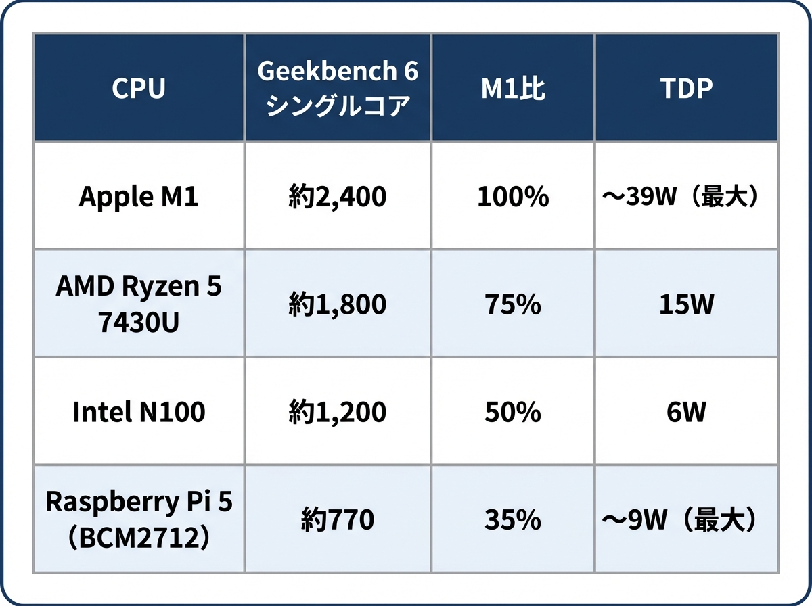
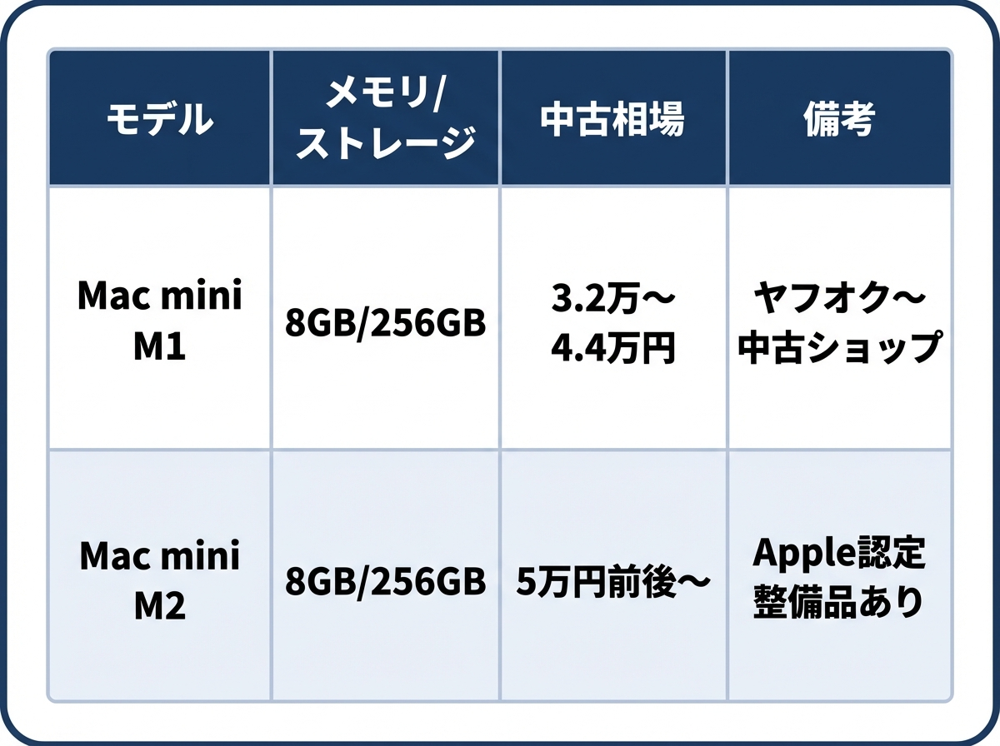
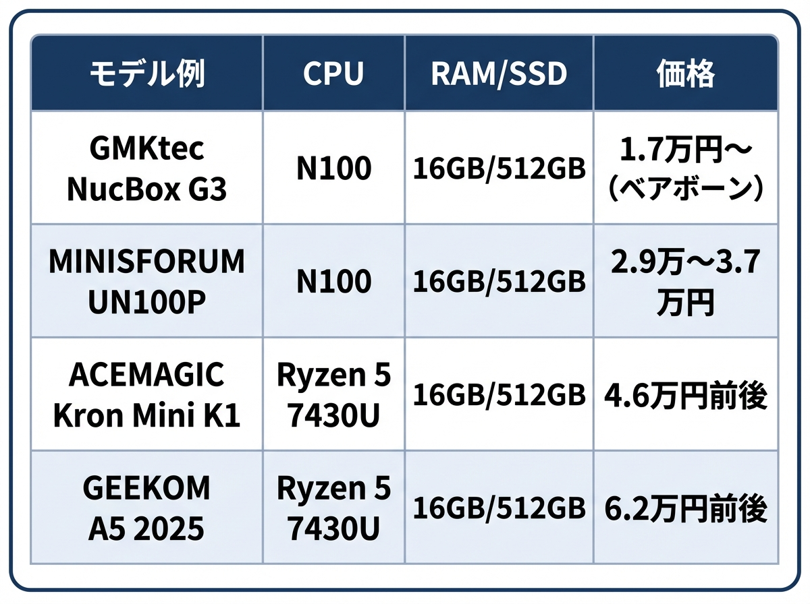
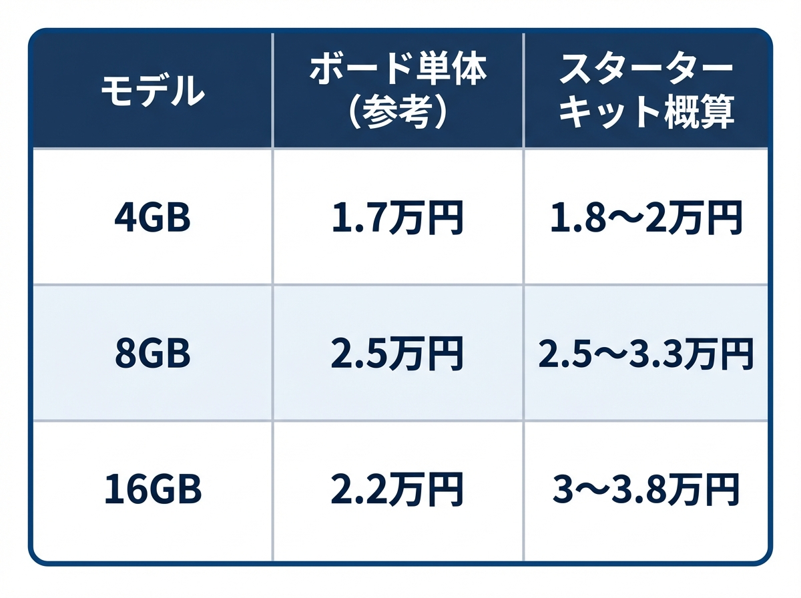
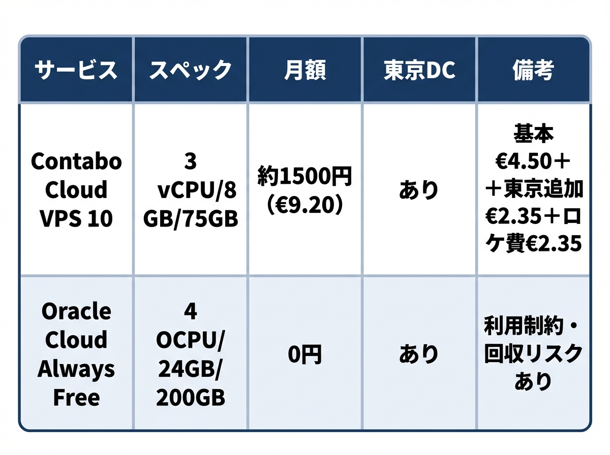
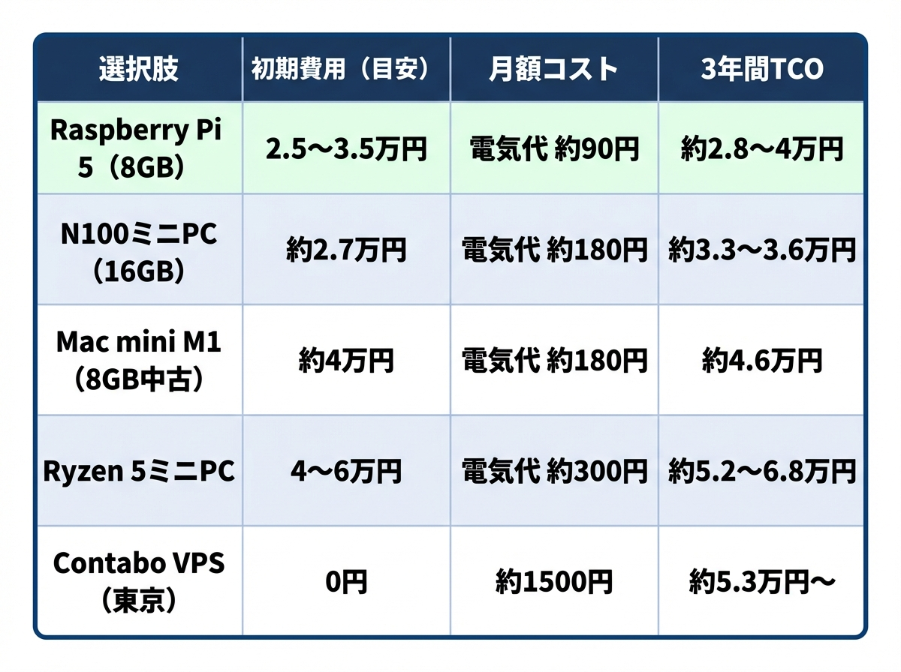
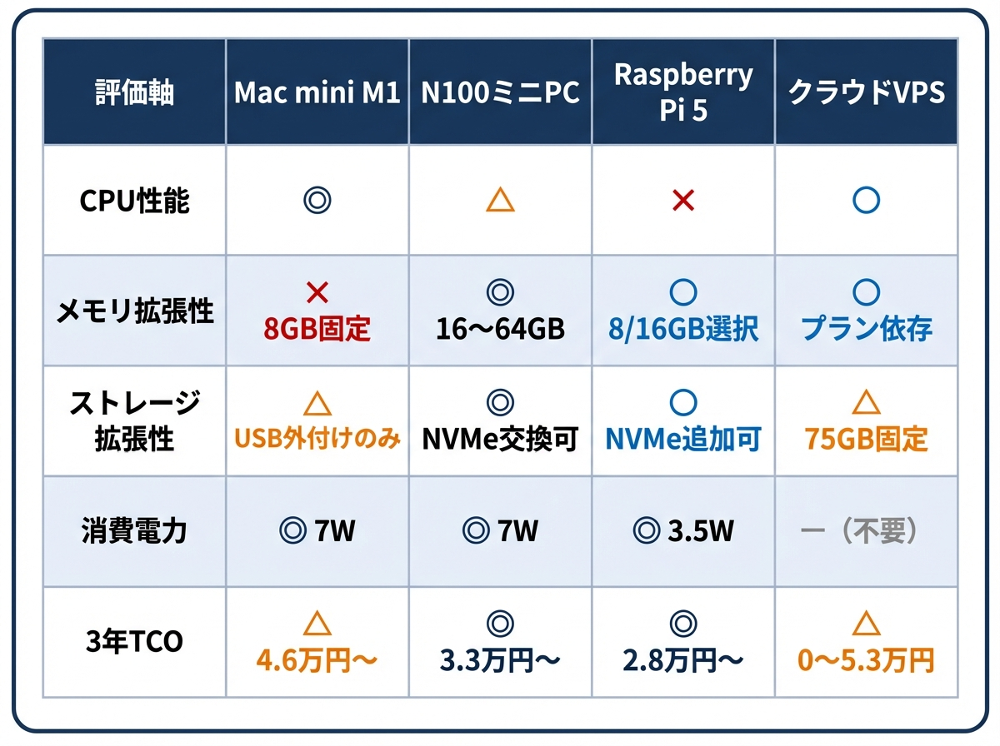

# OpenClaw専用マシンの選び方——5万円以下、4つの現実的な選択肢

24時間自走するAIエージェント「OpenClaw」が話題だ。興味はあるが、リスクもあって導入に踏み切れない人は多い。安全に、コスパよく、使い勝手よく始めるにはどうすればいいか。初期費用5万円以下で手に入る4つの選択肢を比較した。

## 熱狂と不安が同居するOpenClaw

2026年2月、オープンソースのAIエージェント「OpenClaw」がネット上で急速に広まっている。ChatGPTやClaudeのようなAIチャットは、人間が話しかけたときだけ動く。OpenClawは違う。電源を入れたまま放置すれば、定期的に自分で起き上がり、タスクを勝手に進める。履歴はファイルに保存され、昨日の指示も覚えている。LINEやSlackから指示を送れるため、夜に頼んでおけば朝には結果が届く。Redditでは、古いPCでTikTokコンテンツを完全自動化した報告や、Mac mini 1台に13体のAIエージェントを常駐させて全業務を回している動画が話題になっている。

一方で、登場からまだ数カ月のソフトウェアだ。1月末のセキュリティ監査では多数の脆弱性が報告され、クリティカルなものも複数含まれていた。2月に入り急ピッチで修正が進んでいるものの、メインPCへのインストールは避け、専用のマシンで隔離して運用するのが鉄則である。

## 5万円以下で選べる4つの道

OpenClawの頭脳はクラウド上のAI（Claude、ChatGPTなど）であり、手元のマシンは指示の送受信を行う中継地点にすぎない。AI画像生成や動画編集に使うような高性能マシンは不要だ。公式の最小要件はメモリ2GB、推奨は4GB以上。ただし、ブラウザの自動操作を使う場合はブラウザ1つで1〜2GBのメモリを消費するため、メモリ8GB以上が現実的なラインになる。

使っていない古いPCがあるなら、まずそれを試すのが手っ取り早い。メモリ8GB以上ならば十分だ。ノートPCでも蓋を閉じたまま運用できる。新たに調達する場合、話題になっている選択肢は4つある。主要CPUのベンチマークを先に示しておく。

なお、以下の価格情報はいずれも2026年2月時点のものであり、中古市場やセール、為替変動によって変わりうる。

**Mac mini M1（中古）——CPU性能は群を抜くが、拡張性は皆無**

ヤフオクで3万2000〜3万8000円、中古ショップでも4万4000円前後で手に入る。CPUのベンチマーク（Geekbench 6シングルコア約2400）は今回の候補中で最も高く、利用者コミュニティでも「OpenClaw専用機で最も人気のある構成」と評されている。macOSはLinuxに近い環境のため、OpenClawがネイティブに動作する。消費電力は待機時わずか7Wで、つけっぱなしでも月の電気代は約180円だ。

弱点はメモリが購入時のまま固定される点だ。Apple Siliconの構造上、後から増設する手段がない。5万円以下で入手できるのは8GBモデルに限られるため、ブラウザの自動操作を多用する使い方だとメモリが足りなくなる場面が出てくる。ストレージの増設もUSB 3による外付けのみ。世界的に人気が高く中古品は入手しにくくなっており、より高性能だが値段も高いM2に関心が移りつつある。

**Windows ミニPC（N100 / Ryzen 5）——コスパと拡張性の両立**

インテルN100搭載モデルが2万5000〜3万円台、AMD Ryzen 5 7430U搭載モデルが3万2000〜5万円。メモリ16GBが標準で、機種によってはDIMMの換装で64GBまで拡張できるものもある。CPUベンチマークはN100がM1の約50%、Ryzen 5が約75%だが、OpenClawの仕事の大半は「クラウドAIからの返答を待つ時間」であり、手元の処理速度が体感に影響する場面は限られる。待機時の消費電力はN100が7W前後、Ryzen 5が12W前後だ。

WindowsでOpenClawを動かすにはWSL2（マイクロソフト公式のLinux互換機能）を使う。CPUやメモリに若干のオーバーヘッドはあるが、実用上の問題は小さい。ブラウザ自動操作など負荷の高い処理を多用するならRyzen 5が安心だ。後からメモリやストレージを自分で交換・増設できるのが最大の利点で、「まず16GBで始めて、足りなくなったら32GBに」という段階的な運用ができる。GMKtecやMINISFORUM、ACEMAGICなど多くのメーカーから製品が出ており、Amazonで気軽に購入できる。

**Raspberry Pi 5——最省電力だが速度に難あり**

教育用に開発された手のひらサイズのコンピュータだ。8GBモデルのスターターキットで2万5000〜3万3000円。16GBモデルは3万〜3万8000円。消費電力は待機時約3〜4Wと全候補中最小で、3年間の電気代は約3000円で済む。OSはLinuxなので、OpenClawはネイティブに動く。

ただし、CPUベンチマークはM1の約35%にとどまる。指示を出してから反応が返るまで数秒かかるという報告もあり、体感の差は無視できない。価格面でもN100ミニPCと大きな差がなく、16GBモデルにNVMeストレージを追加すると合計でミニPCを超えることもある。安さに惹かれて選んだ結果、追加投資で差が縮まるパターンだ。Linuxに慣れている人にとっては設定が楽という利点はある。

**クラウドVPS——場所を選ばないが、長期では割高**

自宅に機器を置かず、インターネット上のレンタルサーバーで動かす方法だ。いわゆるVPS（仮想専用サーバー）を借りる。

初期費用ゼロで即日使い始められるのが利点だ。ただしContaboは3年使い続けると総額約5万3000円になり、N100ミニPCを買うより高くつく。Oracle Cloudの無料枠なら24GBメモリを月額0円で使えるが、利用率が低いとサーバーを回収される仕様があり、予告なくアカウントごと削除されたという報告も複数ある。大切なデータを預ける先としてはリスクが高い。

## 筆者はRyzen 5搭載ミニPCを選んだ

筆者の場合は、Ryzen 5 7430U搭載の「ACEMAGIC Kron Mini K1」を導入した。Amazonで4万5998円。普段はMacを使っており、数年ぶりのWindowsマシンだった。

セキュリティ設定の硬さにまず手こずった。自分のマイクロソフトアカウントにログインできない、JISキーボードが認識されないなど、初期設定だけで半日を費やした。WSL2の導入自体は問題なかったが、OpenClawは運悪くバグのあるバージョンに当たり、ChatGPTに相談しても解決に至らず1日潰れた。相談先をClaudeに切り替えてようやくOpenClaw側のバグと判明し、解消できた。オープンソースソフトウェアにはこうしたトラブルもつきものだ。現在はコンテンツの自動生成や2次元アイドル的アシスタントなどの実験を行っている。

## 3年間の総コストで比べると

電気代込みの3年間総所有コスト（24時間365日稼働、電力単価35円/kWh）を概算すると、以下のようになる。

3年TCOではN100ミニPCのコスパが光る。Raspberry Pi 5が最安に見えるが、ストレージ追加費用を含めるとN100ミニPCとの差は縮まる。月々の電気代はどれを選んでもコーヒー1杯以下だ。マシン代よりもむしろ気にすべきなのは、OpenClawが問い合わせるクラウドAIの利用料金である。

OpenAIのChatGPTサブスクリプションを持っていればそのまま使えるし、最近は中華系LLMの性能向上が著しい。OpenClaw界隈ではKimi K2.5、MiniMax M2.5、DeepSeek V3.2などが人気で、アリババのQwen3はOpenClaw用の無料枠も用意している。用途によってはこうした選択肢も検討に値する。

最後に4つの選択肢を主要な軸で並べてみる。

拡張性と価格のバランスではN100ミニPCが総合的に扱いやすい。CPU性能を重視するならMac mini M1に体感の差が出る。Raspberry Pi 5は最安だが処理速度の低さは覚悟がいる。クラウドVPSは設置場所を選ばない代わり、長期運用ではコストがかさむ。

イニシャルコストを抑えてまず体験してみたいなら、VPSを借りて小さく始めるのが手軽だ。やれること、やりたいことが見えてきたら、ミニPCやMac miniの導入を改めて検討すればよい。月々の電気代はどの選択肢でもコーヒー1杯以下。始めるハードルは、思ったよりずっと低い。
